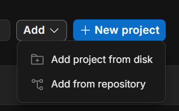
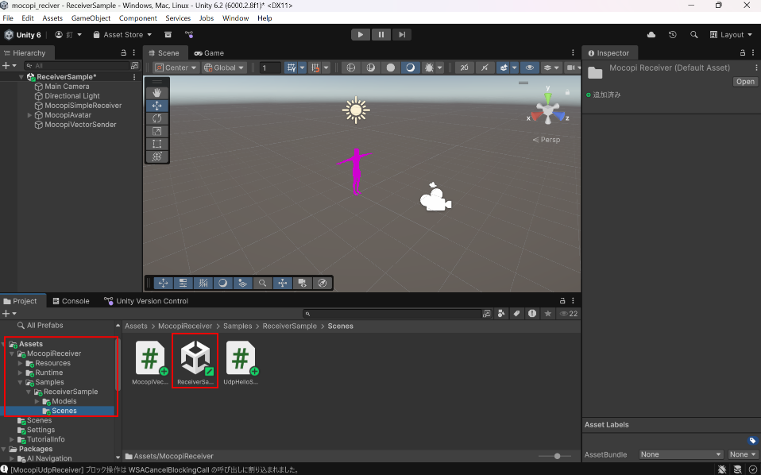

# Robot-Controller

[日本語](README.md) | [中文](README_zh.md)

> **Note**: This document is an AI-generated translation. Please refer to the original Japanese README.md for the most accurate information.

<!-- - How to use stretch_sense
- How to use mocopi
- How to send data to the robot arm via UDP communication
- Control tips -->

## File Structure
`hand_arm`: Contains control code for myCobot320 Pi  
    L `arm_control.py`: Control code  
    L `MyHand.py`: H-100 library  
    L `test_h100.py`: H-100 test code  
    L `requirement.txt`

`main_controller`: Contains communication code for StretchSense, mocopi, and myCobot  
    L `main_controller_v1.py`: Control code  
    L `requirement.txt`

## Environment Setup
- Python 3.11.13  
    - Described in each requirement.txt  
- Unity 6000.2.8f1 or later

## Application Settings
### Before You Begin
Please confirm that the Mycobot320 Pi and your PC are on the same network.

### mocopi App
Download the mocopi app to your smartphone.

Please refer to the following URL for setup:  
https://www.sony.co.jp/en/Products/mocopi-dev/jp/documents/ReceiverPlugin/SendData.html

1. Set up the connection between the mocopi app and PC
2. Switch the mocopi app to sending mode

### stretch sense
Download Hand Engine Lite from the URL below:
https://stretchsense.jp/product/hand-engine-lite/

Enable Open SDK from Edit → settings.
Set `Streaming IP Address` to `127.0.0.1`.
Confirm that `Streaming Ports` is set to `9400`.
Enable `perform/glove/status`, `animation/rotationWithMetacarpals`, `animation/slider/all`, and `command/port/status`.

Please follow the tutorial below for setup:
English: https://vimeo.com/953373249?fl=pl&fe=sh
Japanese (subtitle): https://vimeo.com/930428895?fl=pl&fe=sh

Knowledge base: https://stretchsense.my.site.com/defaulthelpcenter26Sep/s/?language=en_US

### Unity
Clone the project locally from the following repository:
https://github.com/kugishun/mocopi_reciver

Open the cloned project from Unity Hub using `Add project from disk`.

Open `ReciverSample` from `Assets/MoccopiReciver/Sample/Scenes` in the bottom left of the image.

Confirm that `Remote Ip` is set to `127.0.0.1` and `Remote Port` is set to `7001` in `MocopiVectorSender`.

## Code Configuration

Set `MYCOBOT_IP` in `/main_controller/main_controller_v1.py`.
Enter `ip a` in the MyCobot terminal. Set the IP displayed in `inet`.

## Troubleshooting

If it doesn't work after these settings, your PC and MyCobot may not be on the same network.
Please check both networks.
